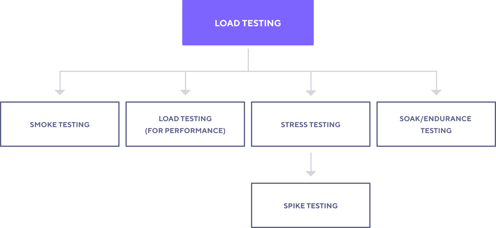

# _Load-Testing_ with K6
Sample project to demonstrate load/performance tests written with K6 running on a CI service.

## Test Types

Each test type is designed to give you different insights about your system.

- **Smoke Test's** role is to verify that your system can handle minimal load, without any problems.

- **Load Test** is primarily concerned with assessing the performance of your system in terms of concurrent users or requests per second.

- **Stress Test** and **Spike testing** are concerned with assessing the limits of your system and stability under extreme conditions.

- **Soak Test** tells you about reliability and performance of your system over an extended period of time.

*The important thing to understand is that each test can be performed with the same test script. You can write one script and perform all the above tests with it. The only thing that changes is the test configuration, the logic stays the same.*

Different test types will teach you different things about your system and give you the insight needed to understand or optimize performance.

Start with a **Smoke** test and see how easy it is to get your first load test running!

#### [Ref: K6 performance test](https://k6.io/)

## Pre-requirements

To run this project, you will need:

- [git](https://git-scm.com/downloads) (I've used version `2.34.1` while writing this doc)
- [nodejs](https://nodejs.org/en/) (I've used version `14.19.3` while writing this doc)
- [NPM](https://www.npmjs.com/) (I've used version `8.13.2` while writing this doc)
- [K6](https://k6.io/) (I've used version `0.39.0` while writing this doc)

**Note:** When installing nodejs, NPM is automatically installed too.

## Installation

To install the dev dependencies, run `npm install` (or `npm i` for short.)

To install K6, follow the steps in the official documentation:
[K6 installation guide](https://k6.io/docs/getting-started/installation/)

**Note:** Check K6 installation with `K6 version` command.

## Running the tests

In this project, you can run tests only in headless mode.
### Headless mode

Run `npm test` (or `npm t` for short) to run all tests in headless mode.
